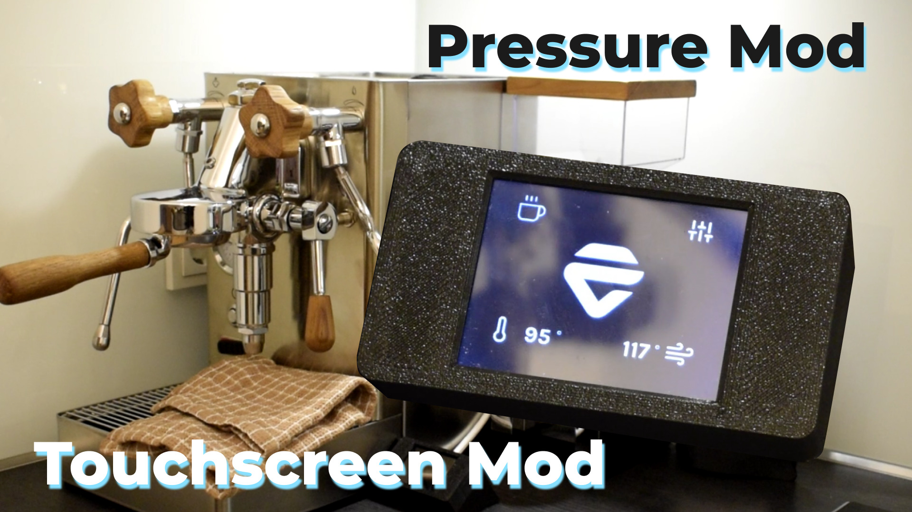
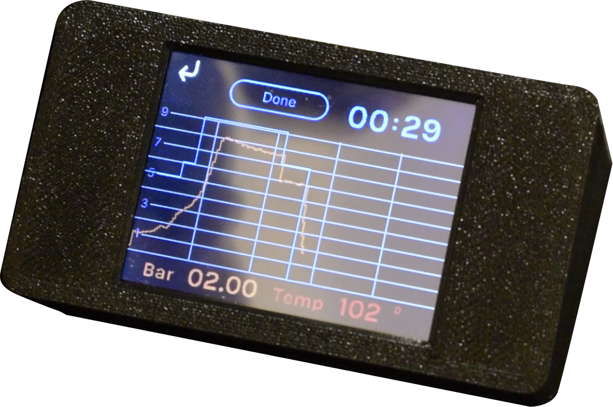
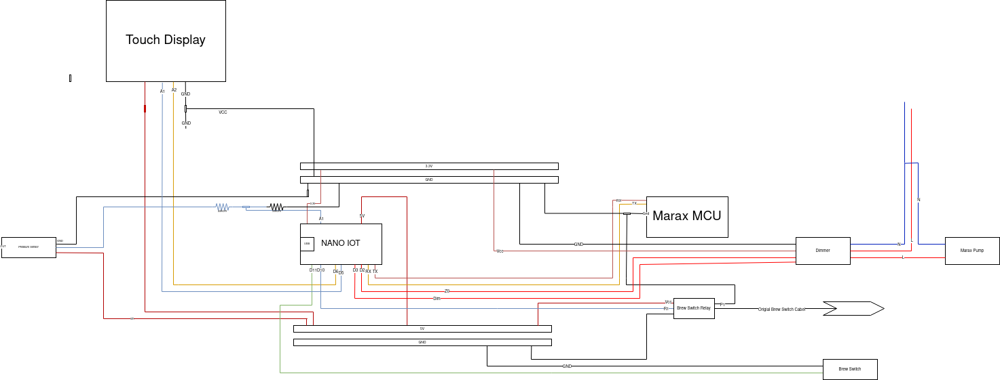

# LELIT MaraX Pressure Mod

This mod can create pressure profiling by reading the current pressure and adjusting the pump over PFC accordingly.

## Demo Videos

- [😁 Meme Version](https://www.youtube.com/watch?v=6iu-tRzNN24) <- Recommended
- [🤏 Shot Version](https://www.youtube.com/watch?v=Ix4moGTFoKE)

## Features

- 📊 Pressure Profiling
- 📝 Touchscreen and visualization
- 📲 Publish Temperatures over MQTT
- 📋 Pressure Readout
- 🛁 Cleaning Mode

## Overview

### Hardware that was used

- [Arduino Nano 33 IOT, SAMD21G18A](https://www.reichelt.de/arduino-nano-33-iot-samd21g18a-mit-header-ard-nano-33iot-h-p261303.html)
- [Pressure Sensor G1/4 5V](https://de.aliexpress.com/item/4000756631924.html?gatewayAdapt=glo2deu)
- [230V AC Dimmer](https://de.aliexpress.com/item/32802025086.html?gatewayAdapt=glo2deu)
- [5mm T-conneter](https://www.landefeld.de/artikel/de/t-steckanschluss-5mm-5mm-iqs-msv-standard-/IQST%2050%20MSV)
- 5mm high pressure pipe
- [5mm to G1/4 Adapter](https://www.landefeld.de/artikel/de/steckanschluss-m-innengew-g-14-5mm-iqs-msv-standard-/IQSF%20145%20MSV)
- [Nextion 2.4 Touchscreen](https://de.aliexpress.com/item/1005003834419474.html?gatewayAdapt=glo2deu)

### Diagramm

### planned todos

| todo                                 | status  | description                                                                                                                                                    |
| ------------------------------------ | ------- | -------------------------------------------------------------------------------------------------------------------------------------------------------------- |
| writing a first build "guide"          | 50%     | -                                                                                                                                                              |
| add a prober wiring diagram          | started | replace the current diagram with a proper one using a suitable program                                                                                     |
| better way of the hardware packaging | planned | this mod was started as a PoC and therefor has a lot of room for improvements regarding resulting hardware packaging / smaller components or even a custom PCB |

## Important notes

- This Project is in no way or form related to LELIT! All trademarks and logos used in this project are for illustrative purposes only and are not intended to indicate any affiliation with any organization or company.
- This Project is for educational purposes only!
- This Mod is not recommended, and this repository is for documentary purpose only! Do not try this mod on our machine

## The goal

My goal with this mod was to try and explore the capability's of pressure profiling espresso and I can for sure say that the end result paid off. Even if the development of this mod was quite challenging, I really improved my knowledge about embedded systems and electrics in geneal. 

### Further ideas
I played a bit with creating the pressure graph in react and then sending the graph points over mqtt to the controller. This step up is definitely interesting to look into a bit more.

### Some more details 
 - the control of the pressure is only possible due to the vibration pump which can be controlled by an AC dimmer
 - all information's are transmitted via MQTT and can then be integrated in for example HomeAssistant

## For more build information's
[Look here](./doc/more_details.md)

### Similar projects 
- [Gaggiuino](https://github.com/Zer0-bit/gaggiuino)
- [MaraX Shot Timer](https://github.com/alexrus/marax_timer)

## License
Apache License Version 2.0